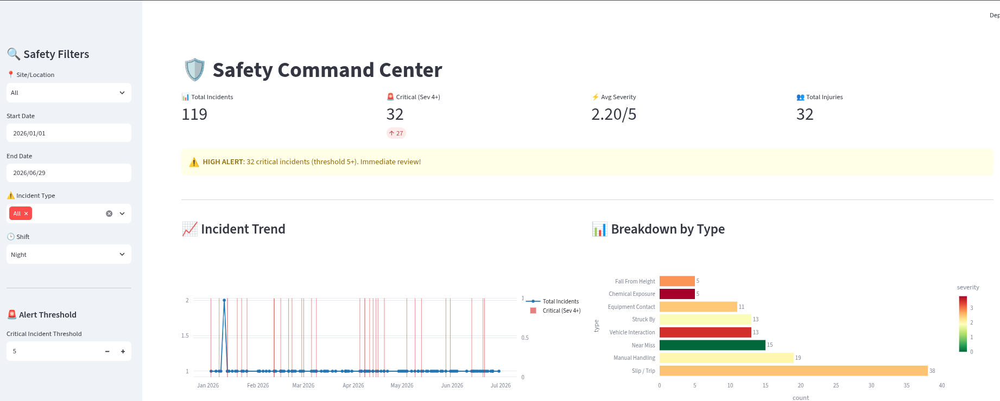
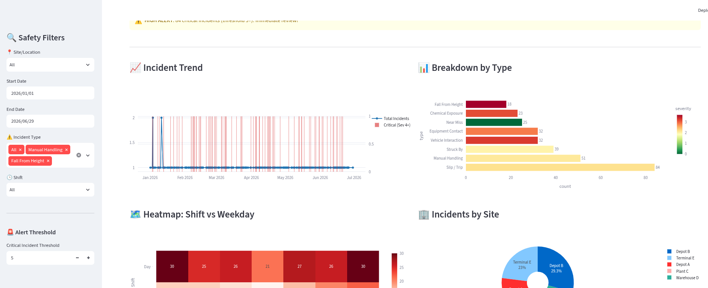

# 🛡️ Safety Command Center

An interactive **HSE safety analytics dashboard** built with **Streamlit, Pandas, and Plotly**. It transforms incident data into actionable insights for monitoring safety performance, identifying risk patterns, and detecting incident hotspots.

## 📊 Dashboard Preview

### Dashboard Overview

Safety Command Center Dashboard

### Safety Analytics & Charts

Safety Analytics Charts

## 🚀 Features

- Interactive filtering by site, date, incident type, and shift
- Safety KPIs for total incidents, critical incidents, severity, and injuries
- Incident trend and category analysis
- Shift and weekday risk heatmap
- Geographic incident hotspot mapping
- Configurable critical-incident alerts
- Filtered CSV data export
- Automatic data column detection and caching


## 📁 Project Structure

```text
Safety-Command/
├── app_safety_dashboard.py
├── requirements.txt
├── README.md
├── shots/
│   ├── t1.png
│   └── t2.png
└── data/
    └── safety_incidents.csv
```


## ⚙️ Requirements

- Python 3.8+
- pip


## 🛠️ Installation

Clone the repository:

```bash
git clone git@github.com:TristanBrian/Safety-Command.git
cd Safety-Command
```

Create and activate a virtual environment:

### Linux / macOS

```bash
python3 -m venv venv
source venv/bin/activate
```


### Windows

```bash
python -m venv venv
venv\Scripts\activate
```

Install dependencies:

```bash
pip install -r requirements.txt
```


## ▶️ Run the Dashboard

Make sure the dataset is available at:

```text
data/safety_incidents.csv
```

Start the application:

```bash
streamlit run app_safety_dashboard.py
```

Open the dashboard at:

```text
http://localhost:8501
```


## 📋 Data

The dashboard supports common fields including:

- `date`
- `time`
- `site` / `location`
- `type` / `incident_type`
- `shift`
- `severity`
- `latitude` / `longitude`
- `injuries`

Incidents with a **severity of 4 or higher** are classified as critical.


## Dashboard Preview

### Dashboard Overview



### Safety Analytics & Charts



## 🔮 Future Enhancements

- PostgreSQL/database integration
- User authentication and role-based access
- Automated email alerts
- Scheduled safety reporting
- Predictive safety analytics


## 📄 License

MIT License.

---

**Built with Streamlit, Plotly, Pandas, and NumPy.**